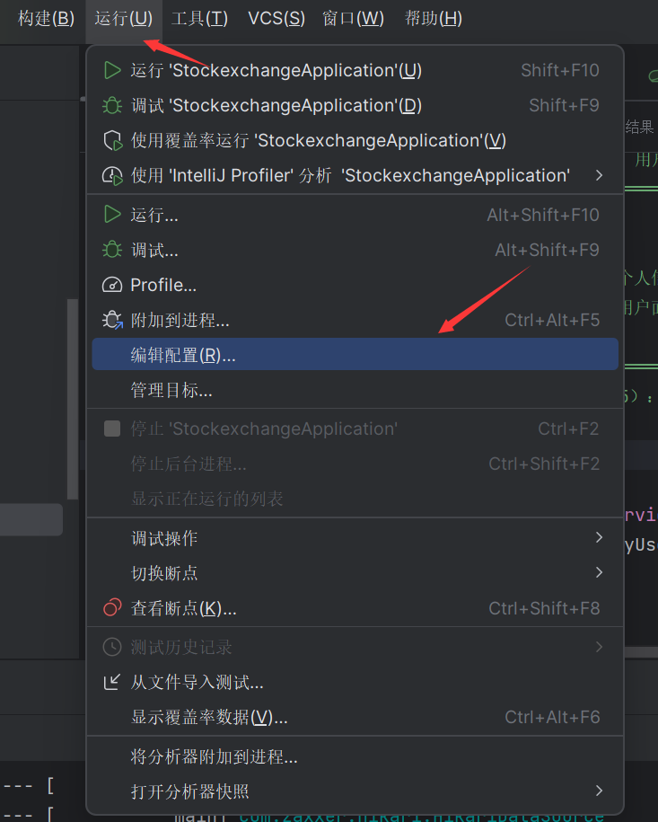
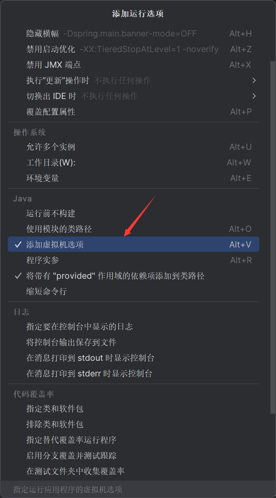
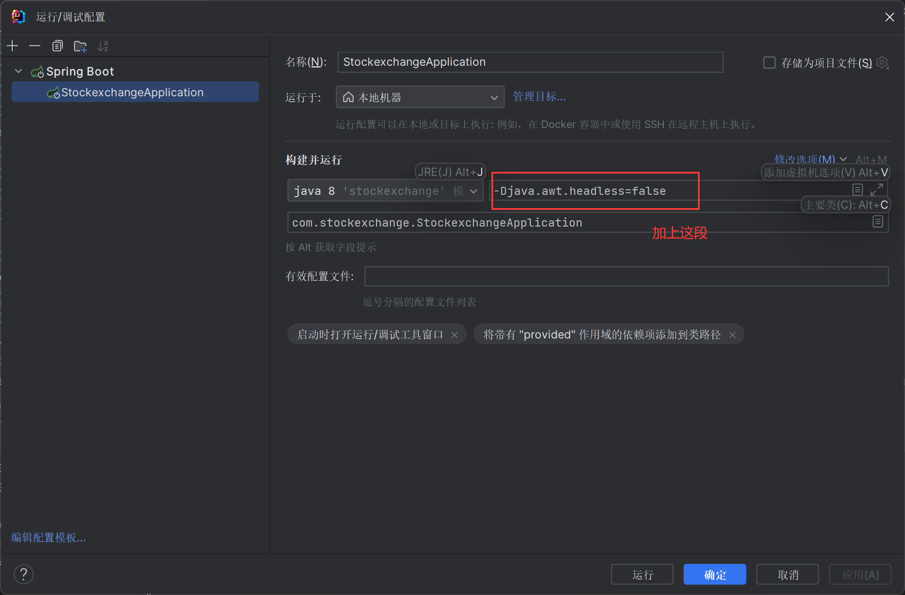

# 模拟股票交易系统

模拟股票交易系统是由夕阳红劲舞团小组（SunsetRed01) 十一位成员联合开发而成的。此项目是本小组的第一个项目，是为了组内成员熟悉项目开发流程、体验项目开发过程、积累项目开发经验而生的。

本项目模拟了股票交易的大概流程，有且不限于用户，管理员登录、用户注册、用户上架股票、管理股票、股票自动涨幅等功能。


## 功能概览

- 登录/注册系统

- 用户上架股票

- 用户买卖股票

- 充值系统

- 查看个人/所有交易记录

- 管理员删除用户

- 管理员修改用户信息

- 管理员删除股票

- 管理员修改股票信息

- 股票列表常驻机制

- 股票自动涨幅机制

  

## 如何开始

### 1. 导入项目

#### 1.1 方式1 IDEA内导入

IDEA -> File -> Open 选择项目

**实例演示：**


#### 1.2 方式2 拖拽到IDEA

**实例演示:**


### 2. 配置项目

#### 2.1 配置MySQL连接

**配置文件位置: stockexchange\src\main\resources\application.yml**

```yaml
spring:
  datasource:
    driver-class-name: com.mysql.cj.jdbc.Driver #数据库引擎
    url: jdbc:mysql://localhost:3306/stock_trade #修改为自己数据库的url
    username: root #账号 默认即root
    password: password #密码
```

#### 2.2 配置mybatis

**配置文件位置: stockexchange\src\main\resources\application.yml**

```yaml
mybatis:
  configuration:
    map-underscore-to-camel-case: true #开启支持驼峰命名
```

#### 2.3 配置MySQL(SQL语句)

**文件位置: stockexchange\db\stock_trade.sql**

如下

```mysql
-- 创建数据库
create database stock_trade;

-- 使用数据库
use stock_trade;

-- 创建user表
CREATE TABLE user (
                      userId INT auto_increment PRIMARY KEY,
                      userName VARCHAR(16) NOT NULL,
                      password VARCHAR(16) NOT NULL,
                      balance DOUBLE,
                      cashBalance DOUBLE
);

-- 创建stock表
CREATE TABLE stock (
                       stockCode INT auto_increment PRIMARY KEY,
                       stockName VARCHAR(16) NOT NULL,
                       currentPrice DOUBLE NOT NULL,
                       increasePercentage DOUBLE,
                       volume INT NOT NULL,
                       marketCap DOUBLE NOT NULL,
                       Profit DOUBLE,
                       userName VARCHAR(16) NOT NULL
);

-- 创建transaction表
CREATE TABLE transaction (
                             transactionId INT auto_increment PRIMARY KEY,
                             transactionType VARCHAR(6),
                             stockName VARCHAR(16),
                             quantity INT NOT NULL,
                             transactionPrice DOUBLE NOT NULL,
                             transactionDate TIMESTAMP NOT NULL,
                             userName VARCHAR(16)
);

-- 创建ownedStocks表
CREATE TABLE ownedStocks (
                             id INT auto_increment PRIMARY KEY,
                             stockName VARCHAR(16),
                             userName VARCHAR(16)
);


-- 向表中插入初始数据
INSERT INTO stock_trade.ownedstocks (id, stockName, userName) VALUES (2, '2222', 'user1');
INSERT INTO stock_trade.ownedstocks (id, stockName, userName) VALUES (32, '3333', 'user2');
INSERT INTO stock_trade.ownedstocks (id, stockName, userName) VALUES (34, '1111', 'user1');
INSERT INTO stock_trade.ownedstocks (id, stockName, userName) VALUES (35, '3333', 'user1');

INSERT INTO stock_trade.stock (stockCode, stockName, currentPrice, increasePercentage, volume, marketCap, Profit, userName) VALUES (1, '1111', 50374.946969467404, 0.18127579819694892, 3, 151124.84090840223, 0, 'user1');
INSERT INTO stock_trade.stock (stockCode, stockName, currentPrice, increasePercentage, volume, marketCap, Profit, userName) VALUES (2, '2222', 49659.503777403224, 0.047869701635583344, 1, 49659.503777403224, 0, 'user1');
INSERT INTO stock_trade.stock (stockCode, stockName, currentPrice, increasePercentage, volume, marketCap, Profit, userName) VALUES (3, '3333', 4804.856770851433, 1.5283590726235208, 3, 14414.570312554299, 0, 'user1');

INSERT INTO stock_trade.transaction (transactionId, transactionType, stockName, quantity, transactionPrice, transactionDate, userName) VALUES (1, 'buy', '3333', 22, 107688.56753977912, '2023-11-29 10:08:21', 'user1');
INSERT INTO stock_trade.transaction (transactionId, transactionType, stockName, quantity, transactionPrice, transactionDate, userName) VALUES (2, 'buy', '3333', 1, 4711.807777495037, '2023-11-29 10:10:19', 'user2');
INSERT INTO stock_trade.transaction (transactionId, transactionType, stockName, quantity, transactionPrice, transactionDate, userName) VALUES (3, 'buy', '1111', 3, 146163.30192771327, '2023-11-29 10:12:28', 'user1');
INSERT INTO stock_trade.transaction (transactionId, transactionType, stockName, quantity, transactionPrice, transactionDate, userName) VALUES (4, 'buy', '1111', 3, 146119.47058525032, '2023-11-29 10:14:57', 'user1');
INSERT INTO stock_trade.transaction (transactionId, transactionType, stockName, quantity, transactionPrice, transactionDate, userName) VALUES (5, 'buy', '3333', 1, 3680.5461031098357, '2023-11-29 10:16:10', 'user1');
INSERT INTO stock_trade.transaction (transactionId, transactionType, stockName, quantity, transactionPrice, transactionDate, userName) VALUES (6, 'sell', '3333', 22, 102695.53614897002, '2023-11-29 10:08:46', 'user1');
INSERT INTO stock_trade.transaction (transactionId, transactionType, stockName, quantity, transactionPrice, transactionDate, userName) VALUES (7, 'sell', '1111', 4, 194981.4193394442, '2023-11-29 10:14:16', 'user1');

INSERT INTO stock_trade.user (userId, userName, password, balance, cashBalance) VALUES (1, 'user1', 'user1', 500000, 1000679.4639995815);
INSERT INTO stock_trade.user (userId, userName, password, balance, cashBalance) VALUES (2, 'user2', 'user2', 5000, 9751.385459748608);
INSERT INTO stock_trade.user (userId, userName, password, balance, cashBalance) VALUES (3, '1234', '1234', 6666, 6666);

```

**使用方式(以Navicat为例)**

- 连接数据库后 点击上方工具栏的新建查询


- 复制粘贴上方SQL语句


- 全选


- 点击 运行已选择的


- 创建成功


<!--(其他可视化工具操作方式与之类似，这里仅以主流操作工具Navicat为例)-->

### 3 关闭无头模式

使用SpringBoot时想要调用swing窗口需要修改运行配置以关闭无头模式，否则调用swing窗口时会报错

- 点击 运行-编辑配置

  

- 点击 修改选项，勾选 添加虚拟机选项

  

  

- 输入 `-Djava.awt.headless=false`


## 使用的技术

- JavaSE
- MySQL
- SpringBoot
- Mybatis
- Maven

